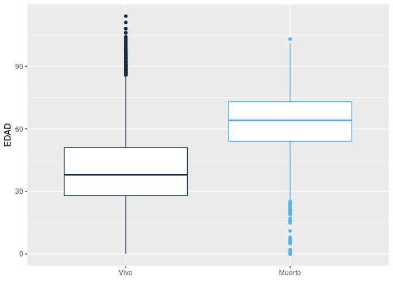
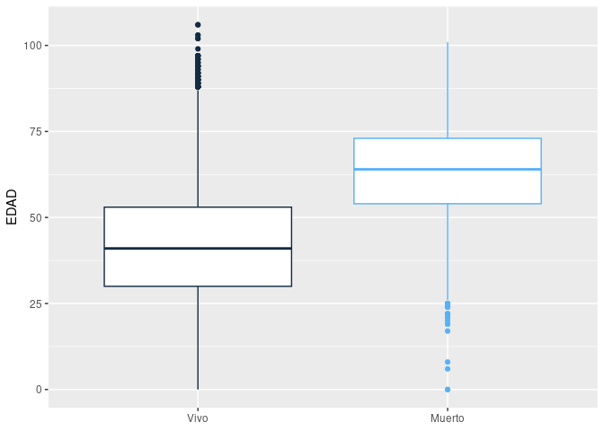
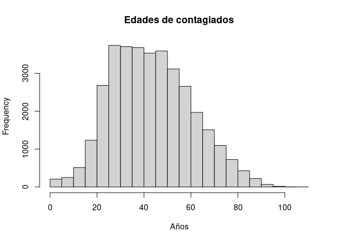
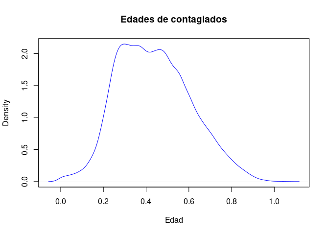
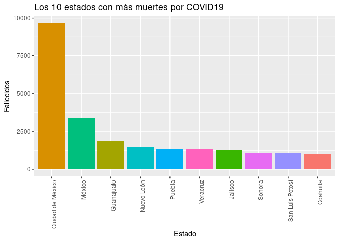
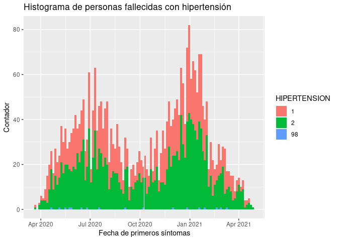
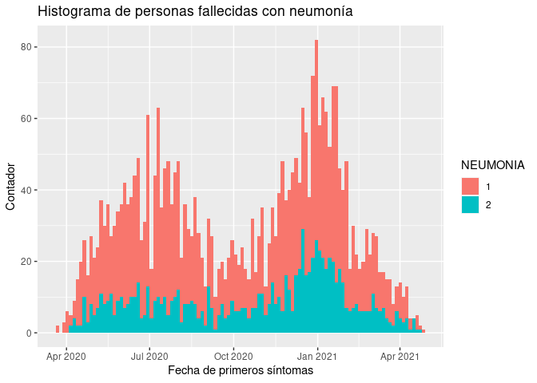
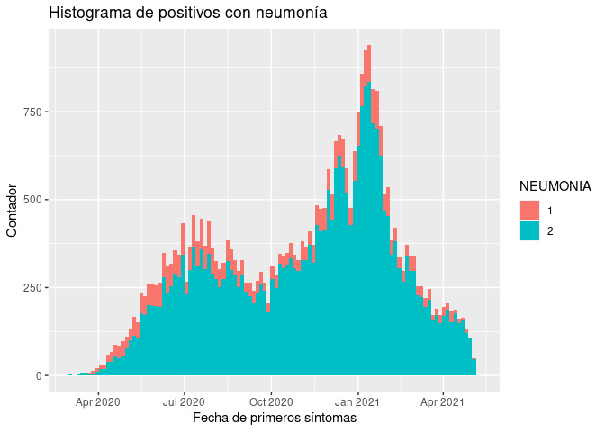

Proyecto Final
================
Erika, Alberto
16/5/2021

El primer paso es cargar la base de datos. Para esto se utiliza el
comando `file.choose()` que nos da la dirección el archivo y seguido de
esto lo abrimos con \`read.csv()\`\`

``` r
data <- read.csv(file.choose())
```

Con el comando `sample()` elegimos 100 mil números aleatorios y después
de esto seleccionamos esas filas del data

``` r
aleatorios <- c(sample(0:length(data$ORIGEN), 100000)) 
data_filtrado <- data[aleatorios,]
```

Para poder ver las primeras filas del data ejecutamos `head()`

``` r
head(data_filtrado)
```

    ## # A tibble: 6 × 40
    ##   FECHA_AC…¹ ID_RE…² ORIGEN SECTOR ENTID…³  SEXO ENTID…⁴ ENTID…⁵ MUNIC…⁶ TIPO_…⁷
    ##   <date>     <chr>    <dbl>  <dbl>   <dbl> <dbl>   <dbl>   <dbl>   <dbl>   <dbl>
    ## 1 2021-05-07 0fbc61       2     13       5     2       5       5      35       1
    ## 2 2021-05-07 02142c       2     12       9     2      21       9      13       1
    ## 3 2021-05-07 d3d6ac       2     12       9     1       9       9       7       1
    ## 4 2021-05-07 4a1604       2      4      15     2      15      15     106       1
    ## 5 2021-05-07 75d708       2     12       9     1       9       9      15       1
    ## 6 2021-05-07 2d2475       2     12       9     2       9       9      11       1
    ## # … with 30 more variables: FECHA_INGRESO <date>, FECHA_SINTOMAS <date>,
    ## #   FECHA_DEF <date>, INTUBADO <dbl>, NEUMONIA <dbl>, EDAD <dbl>,
    ## #   NACIONALIDAD <dbl>, EMBARAZO <dbl>, HABLA_LENGUA_INDIG <dbl>,
    ## #   INDIGENA <dbl>, DIABETES <dbl>, EPOC <dbl>, ASMA <dbl>, INMUSUPR <dbl>,
    ## #   HIPERTENSION <dbl>, OTRA_COM <dbl>, CARDIOVASCULAR <dbl>, OBESIDAD <dbl>,
    ## #   RENAL_CRONICA <dbl>, TABAQUISMO <dbl>, OTRO_CASO <dbl>,
    ## #   TOMA_MUESTRA_LAB <dbl>, RESULTADO_LAB <dbl>, TOMA_MUESTRA_ANTIGENO <dbl>, …

Ahora vamos a convertir en factor todas las columnas excepto las que
indican fechas o edades. Para esto creamos un vector que contenga el
nombre de todas las columnas y despues definimos un segundo vector con
las columnas que van a ser transformadas en vectores

``` r
columnas<- names(data_filtrado)
columnas_factores <- columnas[-c(1,2, 11, 12, 13, 16, 38)]
```

Y finalmente utilizamos `lapply`

``` r
data_filtrado[, columnas_factores] <- lapply(data_filtrado[, columnas_factores], factor)
summary(data_filtrado)
```

    ##  FECHA_ACTUALIZACION  ID_REGISTRO        ORIGEN        SECTOR     
    ##  Min.   :2021-05-07   Length:100000      1:27395   12     :64705  
    ##  1st Qu.:2021-05-07   Class :character   2:72605   4      :27085  
    ##  Median :2021-05-07   Mode  :character             6      : 2758  
    ##  Mean   :2021-05-07                                9      : 2675  
    ##  3rd Qu.:2021-05-07                                3      : 1039  
    ##  Max.   :2021-05-07                                10     :  455  
    ##                                                    (Other): 1283  
    ##    ENTIDAD_UM    SEXO       ENTIDAD_NAC     ENTIDAD_RES    MUNICIPIO_RES  
    ##  9      :40002   1:51794   9      :32984   9      :34215   7      : 7765  
    ##  15     : 5581   2:48206   15     :10959   15     :11121   5      : 5911  
    ##  11     : 4402             11     : 4514   11     : 4428   10     : 3913  
    ##  19     : 4331             19     : 3614   19     : 4317   2      : 3665  
    ##  27     : 3121             30     : 3206   14     : 3104   4      : 3476  
    ##  14     : 3103             21     : 3195   27     : 3101   12     : 3417  
    ##  (Other):39460             (Other):41528   (Other):39714   (Other):71853  
    ##  TIPO_PACIENTE FECHA_INGRESO        FECHA_SINTOMAS         FECHA_DEF         
    ##  1:88817       Min.   :2020-01-03   Min.   :2020-01-01   Min.   :2020-01-13  
    ##  2:11183       1st Qu.:2020-09-06   1st Qu.:2020-09-02   1st Qu.:2020-07-17  
    ##                Median :2020-12-16   Median :2020-12-14   Median :2020-10-30  
    ##                Mean   :2020-11-23   Mean   :2020-11-19   Mean   :2020-10-18  
    ##                3rd Qu.:2021-02-05   3rd Qu.:2021-02-03   3rd Qu.:2021-01-18  
    ##                Max.   :2021-05-06   Max.   :2021-05-06   Max.   :2021-05-06  
    ##                                                          NA's   :95664       
    ##  INTUBADO   NEUMONIA        EDAD        NACIONALIDAD EMBARAZO  
    ##  1 : 1216   1 : 7594   Min.   :  0.00   1:99478      1 :  766  
    ##  2 : 9830   2 :92178   1st Qu.: 28.00   2:  522      2 :50682  
    ##  97:88817   99:  228   Median : 39.00                97:48206  
    ##  99:  137              Mean   : 40.89                98:  344  
    ##                        3rd Qu.: 52.00                99:    2  
    ##                        Max.   :114.00                          
    ##                                                                
    ##  HABLA_LENGUA_INDIG INDIGENA   DIABETES   EPOC       ASMA       INMUSUPR  
    ##  1 :  599           1 :  826   1 : 9894   1 :  907   1 : 2346   1 :  813  
    ##  2 :93829           2 :93680   2 :89877   2 :98906   2 :97463   2 :98989  
    ##  99: 5572           99: 5494   98:  229   98:  187   98:  191   98:  198  
    ##                                                                           
    ##                                                                           
    ##                                                                           
    ##                                                                           
    ##  HIPERTENSION OTRA_COM   CARDIOVASCULAR OBESIDAD   RENAL_CRONICA TABAQUISMO
    ##  1 :13465     1 : 1722   1 : 1398       1 :11681   1 : 1211      1 : 8215  
    ##  2 :86341     2 :97962   2 :98409       2 :88139   2 :98598      2 :91578  
    ##  98:  194     98:  316   98:  193       98:  180   98:  191      98:  207  
    ##                                                                            
    ##                                                                            
    ##                                                                            
    ##                                                                            
    ##  OTRO_CASO  TOMA_MUESTRA_LAB RESULTADO_LAB TOMA_MUESTRA_ANTIGENO
    ##  1 :42645   1:58550          1 :24713      1:39907              
    ##  2 :52776   2:41450          2 :31098      2:60093              
    ##  99: 4579                    3 :  138                           
    ##                              4 : 2601                           
    ##                              97:41450                           
    ##                                                                 
    ##                                                                 
    ##  RESULTADO_ANTIGENO CLASIFICACION_FINAL MIGRANTE   PAIS_NACIONALIDAD 
    ##  1 : 8316           1: 2143             1 :  124   Length:100000     
    ##  2 :31591           2:  146             2 :  345   Class :character  
    ##  97:60093           3:32648             99:99531   Mode  :character  
    ##                     4:  173                                          
    ##                     5: 1065                                          
    ##                     6: 5345                                          
    ##                     7:58480                                          
    ##                     PAIS_ORIGEN    UCI       
    ##  97                       :99876   1 :  798  
    ##  República de Honduras    :   23   2 :10246  
    ##  Estados Unidos de América:   19   97:88817  
    ##  Venezuela                :   14   99:  139  
    ##  Guatemala                :    9             
    ##  Colombia                 :    7             
    ##  (Other)                  :   52

ORIGEN: podemos ver que solo 27395 pacientes de la muestra fueron
reportados en USMER (unidades monitoras de enfermedad respiratoria viral
en todo el país de todo el sector salud: IMSS, ISSSTE, SEDENA, SEMAR,
ETC.) y 72605 tuvieron otro origen.

SECTOR: En esta sección podemos apreciar en que sector fueron atendidos
los pacientes. Podemos apreciar que 64705 pacientes fueron atendidos en
SSA, 27085 en IMSS, 2758 en ISSSTE, 2675 en el sector Privado, 1039 en
Estatal y 1283 en otros sectores variados.

ENTIDAD_UM: Podemos apreciar cuales son las seis entidades con más
pacientes. 40002 en Ciudad de México, 5581 en el Estado de México, 4402
en Guanajuato, 4331 en Nuevo León, 3121 en Tabasco, 3103 en Jalisco y
39460 en las demás entidades.

SEXO: En la muestra tomada se puede apreciar que se tuvo un mayor número
de pacientes mujeres, con un 51794 y 48206 hombres.

TIPO PACIENTE: Se contabilizaron 88817 pacientes ambulatorios y 11183
pacientes hospitalizados.

INTUBADO: Se conoce que fueron intubados 1216 pacientes, 9830 no fueron
intubados, para 88817 no aplica (parece ser que esto se debe a que son
los pacientes ambulatorios) y para 137 pacientes este dato no está
especificado.

NACIONALIDAD: 99478 pacientes son Méxicanos y 522 son extranjeros.

EMBARAZO: Para 48206 este dato no aplica ya que son varones, por lo
tanto se registraron 50682 mujeres no embarazas, 766 que sí estaban
embarazadas, para 344 este dato se ignora y 2 no están especificados.

INDIGENA: De los pacientes 826 son indigenas y 93680 no lo son, mientras
que para 5494 no se especifica.

DIABETES: 9894 pacientes tienen diabetes, 89877 no tienen diabetes y
para 229 se ignora.

EPOC: 907 señalan EPOC y 98906 no lo señalan, para 180 se ignora.

ASMA: 2346 tienen asma, 97463 no tienen asma y para 191 se ignora.

INMUSUPR: 813 pacientes tienen inmunosupresión y 98989 no lo presentan,
para 198 se ignora.

HIPERTENSION: 13465 de los pacientes tienen hipertension, 86341 no
tienen hipertension y para 194 se ignora.

OTRA_COM: 1722 pacientes presentan otra complicación ademas de las aqui
listadas y 97962 no presentan otra complicación, para 316 se ignora.

CARDIOVASCULAR: 1398 lo presentan, 98409 no lo presentan y para 193 se
ignora.

OBESIDAD: 11681 tienen obesidad, 88139 no tienen obesidad y para 180 se
desconoce.

RENAL_CRONICA: 1211 pacientes tiene algun problema renal crónico, 98598
no lo tienen y para 191 se ignora.

TABAQUISMO: 8215 pacientes consumen tabaco, 91578 no lo consumen y para
207 se desconoce.

Para poder filtrar los casos positivos utilizamos el operador lógico `|`

``` r
positivos <- data_filtrado[(data_filtrado$CLASIFICACION_FINAL == 1 | data_filtrado$CLASIFICACION_FINAL == 2 | data_filtrado$CLASIFICACION_FINAL ==  3), ] 

sprintf( "Hay %d casos positivos de COVID19", nrow(positivos))
```

    ## [1] "Hay 34937 casos positivos de COVID19"

Se puede observar que hay un total de 34937 casos positivos de COVID19

En el siguiente chunk se transforma la columna `CLASIFICACION_FINAL`
asignando el valor de 1 si en la columan original habia un 1, 2 o 3; y
un 0 en caso contrario

``` r
data_filtrado <- data_filtrado %>% mutate(CLASIFICACION_FINAL = ifelse(CLASIFICACION_FINAL %in% c(1,2,3), 1, 0))
#Para verificar que se haya hecho bien utilizamos tally para ver el número de repeticiones de 1
data_filtrado %>% group_by(CLASIFICACION_FINAL) %>% tally()
```

    ## # A tibble: 2 × 2
    ##   CLASIFICACION_FINAL     n
    ##                 <dbl> <int>
    ## 1                   0 65063
    ## 2                   1 34937

Para verificar que se ejecuto correctamente lo comprobamos al ver que el
número de ocurrencias de 1 (los casos contagiados) es de 34937, el mismo
que la longitud del dataframe `positivos`

Luego, se va a agregar una columna nueva al dataframe que se va a llamar
`FALLECIMIENTO`, va a tomar el valor de 0 si la fecha de defuncion es
nula y 1 si es el caso contrario

``` r
data_filtrado <- data_filtrado %>% mutate(FALLECIMIENTO = ifelse(is.na(FECHA_DEF)==TRUE, 0, 1))
```

A continuación se grafica un boxplot de las edades de los fallecidos por
COVID19 contra las edades de los que no fallecieron

``` r
ggplot() + geom_boxplot(data_filtrado, mapping =aes(factor(FALLECIMIENTO), EDAD, color = FALLECIMIENTO))+ scale_x_discrete(labels = c("0" = "Vivo", "1" = "Muerto")) + labs(x = NULL)+theme(legend.position = "none") 
```

<!-- -->

La grafica nos dice que la media de la edad de las personas fallecidas
es mayor respecto a la misma de las perosnas vivas pero hay que aclarar
que este diagrama incluye a las personas que salieron negativo en su
prueba de COVID19, por lo tanto vamos a hacer el mismo procedimiento
pero ahora con `positivos`

``` r
#reasignamos la variable "positivos" ya que originalmente no tenia la columna "FALLECIDOS"
positivos <- data_filtrado[(data_filtrado$CLASIFICACION_FINAL == 1),]

ggplot() + geom_boxplot(positivos, mapping =aes(factor(FALLECIMIENTO), EDAD, color = FALLECIMIENTO))+ scale_x_discrete(labels = c("0" = "Vivo", "1" = "Muerto")) + labs(x = NULL)+theme(legend.position = "none") 
```

<!-- -->

En esta nueva gráfica podemos ver que los valores de las medias
cambiaron con respecto a la gráfica anterior. La edad media para las
personas que tuvieron COVID19 y no fallecieron fue de aproximadamente 37
años, mientras que la media para las personas que fallecieron a causa de
COVID19 es de 63 años. Otra cosa que se puede notar es el rango de las
personas fallecidas, vemos que inicia en un valor 0, el cual
probablemente es un dato erroneo, pero a partir de los 25 años se
observa que ya son valores constantes, entonces podrias considerar el
rango de 25 a los 100 años Podemos concluir que las personas de mayor
edad son más propensas a fallecer a causa de esta enfermedad y las más
jovenes tienden a ser más resitente aunque claro que siempre hay
excepciones. Esto lo podemos corroborar ya que la caja de `vivos` tiene
una linea punteada en la parte de arriba que indica que pocas personas
de edad avanzada sobrevivieron

A continuación se contará el número de registros perdidos por columna.

``` r
Conteo.NA <- function(x){
  sum(x == 99)
}

sapply(data_filtrado, Conteo.NA)
```

    ##   FECHA_ACTUALIZACION           ID_REGISTRO                ORIGEN 
    ##                     0                     0                     0 
    ##                SECTOR            ENTIDAD_UM                  SEXO 
    ##                     2                     0                     0 
    ##           ENTIDAD_NAC           ENTIDAD_RES         MUNICIPIO_RES 
    ##                   524                     0                   147 
    ##         TIPO_PACIENTE         FECHA_INGRESO        FECHA_SINTOMAS 
    ##                     0                     0                     0 
    ##             FECHA_DEF              INTUBADO              NEUMONIA 
    ##                    NA                   137                   228 
    ##                  EDAD          NACIONALIDAD              EMBARAZO 
    ##                     5                     0                     2 
    ##    HABLA_LENGUA_INDIG              INDIGENA              DIABETES 
    ##                  5572                  5494                     0 
    ##                  EPOC                  ASMA              INMUSUPR 
    ##                     0                     0                     0 
    ##          HIPERTENSION              OTRA_COM        CARDIOVASCULAR 
    ##                     0                     0                     0 
    ##              OBESIDAD         RENAL_CRONICA            TABAQUISMO 
    ##                     0                     0                     0 
    ##             OTRO_CASO      TOMA_MUESTRA_LAB         RESULTADO_LAB 
    ##                  4579                     0                     0 
    ## TOMA_MUESTRA_ANTIGENO    RESULTADO_ANTIGENO   CLASIFICACION_FINAL 
    ##                     0                     0                     0 
    ##              MIGRANTE     PAIS_NACIONALIDAD           PAIS_ORIGEN 
    ##                 99531                     0                     0 
    ##                   UCI         FALLECIMIENTO 
    ##                   139                     0

``` r
RegistrosPerdidos <- sapply(data_filtrado, function(x){sum(x == 99)})
RegistrosPerdidos
```

    ##   FECHA_ACTUALIZACION           ID_REGISTRO                ORIGEN 
    ##                     0                     0                     0 
    ##                SECTOR            ENTIDAD_UM                  SEXO 
    ##                     2                     0                     0 
    ##           ENTIDAD_NAC           ENTIDAD_RES         MUNICIPIO_RES 
    ##                   524                     0                   147 
    ##         TIPO_PACIENTE         FECHA_INGRESO        FECHA_SINTOMAS 
    ##                     0                     0                     0 
    ##             FECHA_DEF              INTUBADO              NEUMONIA 
    ##                    NA                   137                   228 
    ##                  EDAD          NACIONALIDAD              EMBARAZO 
    ##                     5                     0                     2 
    ##    HABLA_LENGUA_INDIG              INDIGENA              DIABETES 
    ##                  5572                  5494                     0 
    ##                  EPOC                  ASMA              INMUSUPR 
    ##                     0                     0                     0 
    ##          HIPERTENSION              OTRA_COM        CARDIOVASCULAR 
    ##                     0                     0                     0 
    ##              OBESIDAD         RENAL_CRONICA            TABAQUISMO 
    ##                     0                     0                     0 
    ##             OTRO_CASO      TOMA_MUESTRA_LAB         RESULTADO_LAB 
    ##                  4579                     0                     0 
    ## TOMA_MUESTRA_ANTIGENO    RESULTADO_ANTIGENO   CLASIFICACION_FINAL 
    ##                     0                     0                     0 
    ##              MIGRANTE     PAIS_NACIONALIDAD           PAIS_ORIGEN 
    ##                 99531                     0                     0 
    ##                   UCI         FALLECIMIENTO 
    ##                   139                     0

Ahora queremos cambiar el nombre de la columna CLASIFICACION_FINAL por
“CONTAGIADO”

``` r
data_filtrado <- rename(data_filtrado, c(CONTAGIADO = "CLASIFICACION_FINAL"))
names(data_filtrado)
```

    ##  [1] "FECHA_ACTUALIZACION"   "ID_REGISTRO"           "ORIGEN"               
    ##  [4] "SECTOR"                "ENTIDAD_UM"            "SEXO"                 
    ##  [7] "ENTIDAD_NAC"           "ENTIDAD_RES"           "MUNICIPIO_RES"        
    ## [10] "TIPO_PACIENTE"         "FECHA_INGRESO"         "FECHA_SINTOMAS"       
    ## [13] "FECHA_DEF"             "INTUBADO"              "NEUMONIA"             
    ## [16] "EDAD"                  "NACIONALIDAD"          "EMBARAZO"             
    ## [19] "HABLA_LENGUA_INDIG"    "INDIGENA"              "DIABETES"             
    ## [22] "EPOC"                  "ASMA"                  "INMUSUPR"             
    ## [25] "HIPERTENSION"          "OTRA_COM"              "CARDIOVASCULAR"       
    ## [28] "OBESIDAD"              "RENAL_CRONICA"         "TABAQUISMO"           
    ## [31] "OTRO_CASO"             "TOMA_MUESTRA_LAB"      "RESULTADO_LAB"        
    ## [34] "TOMA_MUESTRA_ANTIGENO" "RESULTADO_ANTIGENO"    "CONTAGIADO"           
    ## [37] "MIGRANTE"              "PAIS_NACIONALIDAD"     "PAIS_ORIGEN"          
    ## [40] "UCI"                   "FALLECIMIENTO"

A continuación calculamos la media de edades de los contagios de COVID.

``` r
edades_contagiados <- positivos$EDAD
Media_Edades <- mean(edades_contagiados)
Media_Edades
```

    ## [1] 43.7952

Podemos ver que la media es de 43.7952.

``` r
hist(edades_contagiados, main= "Edades de contagiados", xlab = "Años")
```

<!-- --> En el
histogramá podémos observar que una gran mayoría ronda entre los 20 y 60
años.

``` r
plot(density(edades_contagiados/100), main = "Edades de contagiados", xlab = "Edad", col = "blue")
```

<!-- --> Finalmente
graficamos los 10 estados con más muertes por COVID19

``` r
#Creamos contador_por_estados que es un data con los registros de muertes agrupados por estado y al final lor ordenamos de mayor a menor 
contador_por_estados <- positivos %>% group_by(ENTIDAD_NAC) %>% summarize(n=n()) %>% arrange(-n)

#Se nombra al data primero_10Estados que son las primeras filas del data de arriba
primero_10Estados <- contador_por_estados[c(1:10),]

#Y se grafica con ggplot
#Con "reorder" ordenamos los valores de mayor a menor ya que si esto no lo seleccoinamos entonces ggplot los ordena conforme al número de estdo, primero estaría el 5, despues el 9 y así consecutivamente

primero_10Estados %>%  ggplot(aes(x=reorder(ENTIDAD_NAC, -n), y = n, fill=ENTIDAD_NAC)) + geom_bar(stat = "identity")+ scale_x_discrete(labels = c("9" = "Ciudad de México", "15" = "México", "11" = "Guanajuato", "19" = "Nuevo León", "30" = "Veracruz", "21" = "Puebla", "14" = "Jalisco", "27" = "Tabasco", "24" = "San Luis Potosí", "26"="Sonora", "5" = "Coahuila")) + theme(axis.text.x = element_text(angle = 90, hjust = 1)) +theme(legend.position = "none") + labs(x = "Estado", y="Fallecidos", title = "Los 10 estados con más muertes por COVID19")
```

<!-- --> Despues de
ver el gráfico podemos ver que hay una enorme diferencia entre la
medicion de la CDMX y los demás estados. Otra cosa es que los 10 estados
seleccionados coincide casi a la perfección con la lista de los 10
estado más poblados por lo que podriamos decir como hipótesis que las
variables de `FALLECIDOS` y `ENTIDAD_NAC` tiene una buena correlacion

A continuación buscamos el porcentaje de personas contagiadas por
COVID-19

``` r
Total <- nrow(data_filtrado)
Contagios <- nrow(positivos)

porcentaje_contagiados <- function(Total,Contagios){
  (Contagios/Total)*100
}

sprintf( "El %f porciento de los pacientes dieron positivo para COVID-19", porcentaje_contagiados(Total,Contagios))
```

    ## [1] "El 34.937000 porciento de los pacientes dieron positivo para COVID-19"

Finalmente vamos a graficar a las personas fallecidas, para esto creamos
el data `fallecidos` e imprimimos su media y la desviación estanda.
Después graficamos las fechas en las que empezarón sus síntomas y en el
argumetno `fill` le ponemos `HIPERTENSION` para ver aproximadamente
cuantas personas tenian esta enfermedad

``` r
fallecidos <- positivos[positivos$FALLECIMIENTO==1,]

#Grafica de si hubo alguna fecha en la que los fallecidos incrementaron
ggplot(fallecidos, aes(x=FECHA_SINTOMAS, fill = HIPERTENSION)) +geom_histogram(bins=110) + labs(x = "Fecha de primeros síntomas", y="Contador", title = "Histograma de personas fallecidas con hipertensión")
```

<!-- -->

``` r
print(mean(fallecidos$EDAD))
```

    ## [1] 63.30201

``` r
print(sd(fallecidos$EDAD))
```

    ## [1] 14.04704

El primer aspecto que llama la atención son las dos grandes curvas en
Julio del 2020 y en Enero del 2021, aquí se ven representadas las dos
olas de COVID que ha tenido México Adicionalmente tenemos que más del
50% de las personas fallecidas tenían hipertensión, lo cual nos dice que
es muy peligroso tener COVID e hipertensión. Por otro lado observamos
que la edad promedio de las personas fallecidas es de 63 años; eran
personas de la tercera edad en su mayoría. Ahora vamos a hacer lo mismo
pero en lugar de `HIPERTENSIÓN` vamos a poner `NEUMONIA`

``` r
ggplot(fallecidos, aes(x=FECHA_SINTOMAS, fill = NEUMONIA)) +geom_histogram(bins=110) + labs(x = "Fecha de primeros síntomas", y="Contador", title = "Histograma de personas fallecidas con neumonía")
```

<!-- --> Claramente
podemos ver que casi todas las personas fallecidas padecieron de
neumonía, esto nos indicia que o bien es muy común este síntoma o es muy
mortal. Para poder dar una respuesta a esto último vamos a hacer la
misma gráfica pero ahora con las personas que salieron positivos, es
decir, tomando a las personas que sobrevivieron:

``` r
ggplot(positivos, aes(x=FECHA_SINTOMAS, fill = NEUMONIA)) +geom_histogram(bins=110) + labs(x = "Fecha de primeros síntomas", y="Contador", title = "Histograma de positivos con neumonía")
```

<!-- --> Podemos
concluir que la neumonía es una enfermedad mortal. Y para finalizar
vamos a ver el tiempo que hay entre los primeros síntomas y la muerte,
es decir, vamos a calcular la diferencia entre las columnas
`FECHA_síntomas` y `FECHA_DEF`

``` r
diferencia <- as.Date(fallecidos$FECHA_DEF, "%Y-%m-%d") - as.Date(fallecidos$FECHA_SINTOMAS, "%Y-%m-%d")

print(mean(diferencia))
```

    ## Time difference of 13.72788 days

El resultado nos dice que en promedio una persona puede morir 13 días
despues de haber presentado los primero síntomas
